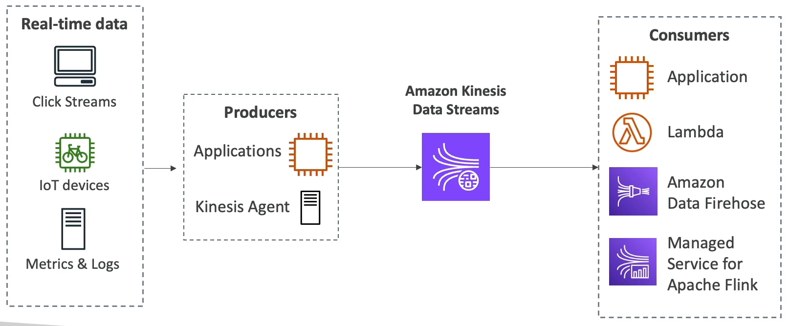

## Introduction

- Collect and store streaming data in real time.

- Data retention up to 365 days.
- Ability to reprocess data by cosumers.
- Data cannot be deleted, until it expires.
- Data upto 1 MB/s (typical use case is a lot of small realtime data.)
- Data ordering is guarantee for data with the same partition ID.
- At rest KMS encryption, in-flight HTTPS encryption.
- Kinesis Producer Library (KPL) to write an optimized producer application.
- Kinesis Client Library (KCL) to write an optimized consumer applciation.

## Capacity Modes

### Provisioned Mode

- Choose number of shards.
- Each shard gets 1 MB/s in (or 1000 records per second)
- Each shard gets 2 MB/s out
- Scale manually to increase or decrease the number of shards.
- You pay per shard provisioned per hour.

### On-demand Mode

- No need to provision or manage the capacity.
- Default capacity; 4 MB/s in or 4000 records per second.
- Scales automatically based on observed throughput peak during the last 30 days.
- Pay per stream per hour and data in/out per GB.

## Troubleshooting Producers: Performance

### Writing is too slow

- Service limits may be exceeded. Check of throughput exceptions, see what operations are being throttled. Different calls have different limits.
- Shard level limits for writes and reads.
- Other operations (CreateStream, ListStreams, DescribeStreams) have stream level limits of 5-220 calls per second.
- Select partition key to evenly distribute puts across shards.

### Large Producers

- Batch things up. Use Kinesis Producer Library. PutRecords with multi-records, or aggregate records into larger files.

### Small Producers

- Use PutRecords or Kinesis Recorder in the AWS Mobile SDKs.

### Stream returns a 500 or 503 error

- This returns AmazonKinesisException error rate above 1%.
- Implement a retry mechanism.

### Connection errors from Flink to Kinesis

- Network issue or lack of resources in Flink's environment
- Could be a VPC misconfiguration.

### Timeout errors from Flink to Kinesis

- Adjust RequestTimeout and \#setQueueLimit on FlinkKinesisProducer

### Throttling errors

- Check for hot shards with enhanced monitoring
- Check logs for micro spikes or obscure metrics breaching limits.
- Try a random partition key or improve the key's distribution
- Rate-limit

## Troubleshooting Consumers

### Lambda function cant get invoked

- Permissions issue on execution role.
- Function is timing out (check max execution time)
- Breaching concurrency limits
- Monitor IteratorAge metric; it will increase is this a problem.

### High Latency

- Monitor with GetRecords.Latency and IteratorAge
- Increase shards
- Increase retention period
- Check CPU and memory utilization
