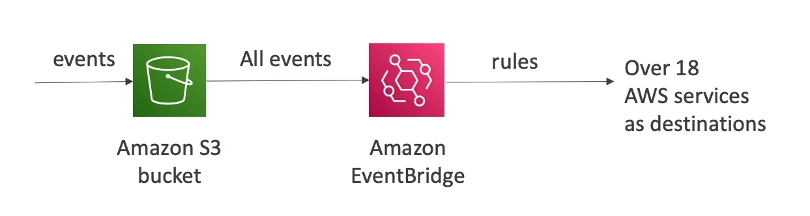
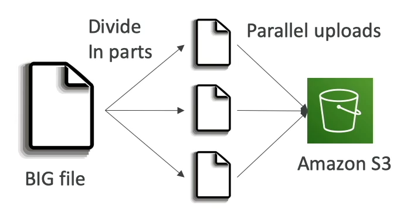
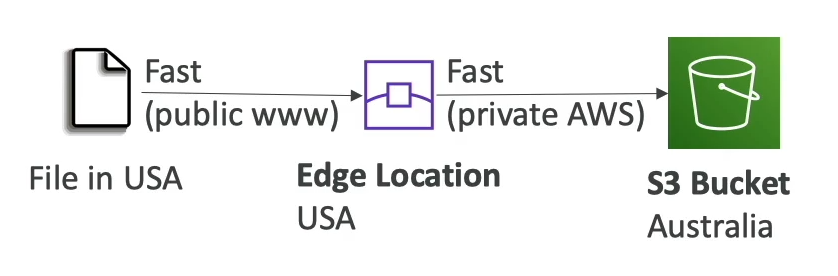
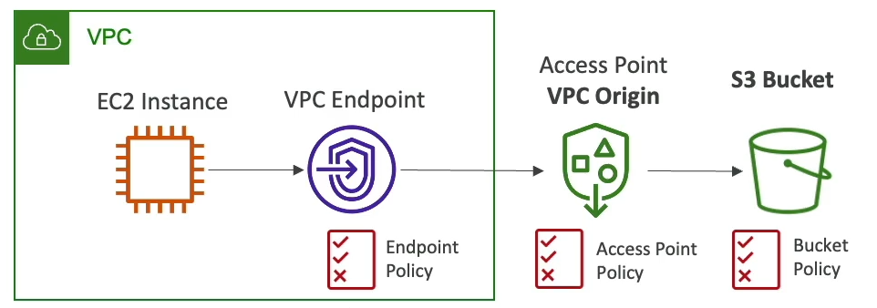
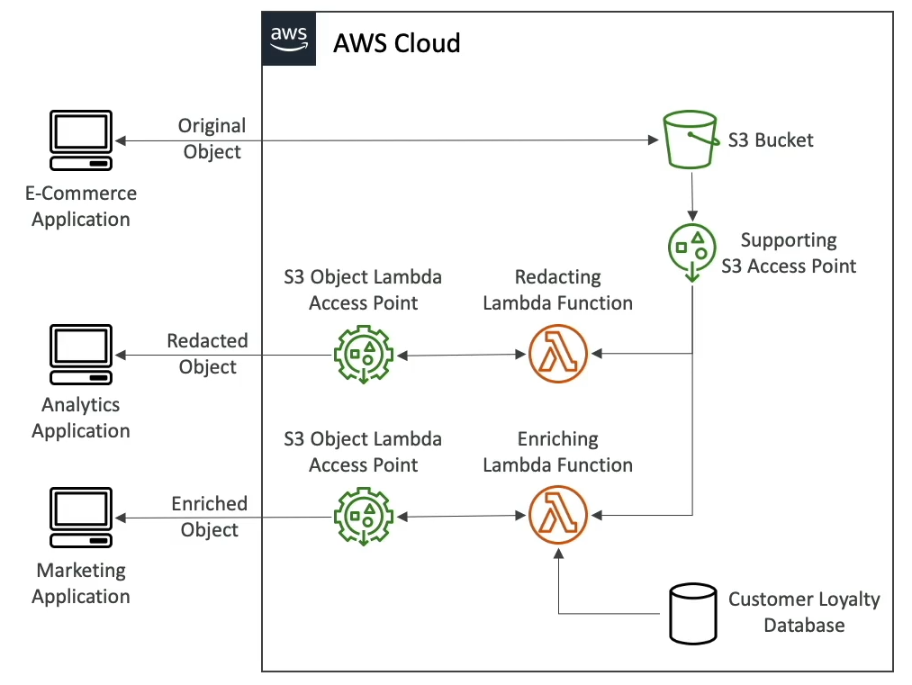

## Introduction

- One of the main building blocks of AWS
- Advertised as "infinitely scaling" storage
- Many websites use S3 as a backbone
- Many AWS services uses S3 as an integration as well

## Use Cases

- Backup and Storage
- Disaster Recovery
- Archive
- Hybrid Cloud Storage
- Host Application and Media
- Data Lakes and Big Data Analytics
- Software Delivery
- Static Wesbsite

## Buckets

- S3 allows people to store objects (files) in buckets (directories).
- Must be globally unique name
- S3 looks like a global service but buckets are created in a region.
- Naming convention
  - No uppercase, No underscore
  - 3-63 characters long
  - Not an IP
  - Must start with a letter or number
  - Must NOT start with prefix xn--
  - Must NOT end with suffix --s3alias

## Objects

- Objects (files) have a Key.
- The Key is the full path to the object. It has prefix + object name.
  - s3://my-bucket/myfile.txt
  - s3://my-bucket/folder1/myfile.txt
- No concepts of directories within bucket; however, UI tricks you to think otherwise.
- Object values are content of the body.
  - Max object size is 5TB.
  - If uploading more than 5GB, must use "multi-part" upload.
- Metadata
- Tags (unicode key-value pair, up to 10), useful for security/lifestyle.
- Version ID (if versioning is enabled)

## Security

### User-Based

- **IAM Policies**: Which API calls should be allowed for a specific user from IAM.

### Resource-Based

- **Bucket Policies**: Bucket wide rules from the S3 console - allows cross account.
- **Object Access Control List (ACL)**
- **Bucket Access Control List (ACL)**

> **Note**: An IAM principal can access an S3 object if,
>
> - The user IAM permissions ALLOW it OR the resource policy ALLOWS it
> - AND there is no explicit DENY.

### Encryption

- Encrypt objects in S3 using encryption keys.

## S3 Bucket Policy

### JSON based policies

```
{
	"Version": "",
	"Statement": [
		{
			"Sid": "PublicRead",
			"Effect": "Allow",
			"Principal": "*",
			"Action": [
				"s3:GetObject"
			],
			"Resource": [
				"arn:aws:s3:::examplebucket/*"
			]
		}
	]
}
```

- **Resources**: buckets and objects
- **Effect**: Allow / Deny
- **Actions**: Set of API to Allow or Deny
- **Principal**: The account or user to apply the policy to
  Use S3 bucket policy to:
- Grant public access to the bucket.
- Force objects to be encrypted at upload.
  Example:
- Public Access - Use Bucket Policy
- User Access to S3 - IAM Permissions
- EC2 Instance Access - Use IAM Roles
- Cross-Account Access - Use Bucket Policy
- Bucket Settings for Block Public Access

## Versioning

- Can version files in S3
- Enabled at bucket level
- Same key overwrite will change the version
- Best practice to version
  - Protect against unintended deletes
  - Easy roll back

> Note:
>
> - Any file that is not versioned prior to enabling versioning will have version "null".
> - Suspending versioning does not delete the previous version.

## Replication (CRR & SRR)

- Must enable versioning in source and destination buckets.
- Cross-Region Replication (CRR)
- Source-Region Replication (SRR)
- Buckets can be in different AWS accounts
- Copying is asynchronous
- Must give proper IAM permissions to S3
- After enabling replication, only new objects are replicated.
- Use S3 Batch Replication to replicate existing objects or objects that failed replication.
  DELETE operations
- Can replication delete markers from source to target (optional setting)
- Deletions with version id are not replicated
  There is no chaining
- If bucket 1 has replication to bucket 2, which has replication to bucket 3, the objects created in bucket 1 are not replicated in bucket 3.
  Use Cases:
- CRR: Compliance, lower latency access, replication across accounts.
- SRR: log aggregation, live replication between prod and test accounts.

## Storage Classes

- Amazon S3 Standard - General Purpose
- Amazon S3 Standard-Infrequent Access
- Amazon S3 One Zone-Infrequent Access
- Amazon S3 Glacier Instant Retrieval
- Amazon S3 Glacier Flexible Retrieval
- Amazon S3 Glacier Deep Archive
- Amazon S3 Intelligent Tiering

- Can move objects between classes manually or using S3 lifecycle

## Durability and Availability

### Durability

- High durability (`99.999999999%`, 11 9s) of objects across multiple AZ
- If you store 10 million object with Amazon S3, on average expect to lose 1 object once in every 10,000 years.
- Same for all storage class

### Availability

- Measures how readily available a service is.
- Varies depending on storage class.
- Example: S3 standard has 99.99% availability, that is, not available for 53 minutes a year.

## S3 Standard - General Purpose

- 99.99% available
- Used for frequently accessed data
- Low latency and high thoughput
- Sustain 2 concurrent facility failures
- **Use Cases**: Big Data Analytics, Mobile and Gaming apps, content distribution

## S3 Storage Classes - Infrequent Access

- Data that is less frequently accessed, but requires rapid access when needed.
- Lower cost than S3 standard.

### Amazon S3 Standard-Infrequent Access

- 99.9% available
- **Use Cases**: Disaster Recovery, backups

### Amazon S3 One Zone-Infrequent Access

- High durability (99.999999999%) in single AZ; data lost when AZ is destroyed.
- 99.5% available
- **Use Cases**: Storing secondary backup of on-prem data or recreatable data.

## Amazon S3 Glacier Storage Classes

- Low-cost object storage meant for archiving / backup
- Pricing: price for storage and object retrieval cost.

### Amazon S3 Glacier Instant Retrieval

- Millisecond retrieval
- Great for data accessed once a quarter
- Minimum storage duration of 90 days

### Amazon S3 Glacier Flexible Retrieval

- Expected (1-5 minutes), Standard (3-5 hours), Bulk (5-12 hours) - free
- Minimum storage duration of 90 days

### Amazon S3 Glacier Deep Archive

- Standard (12 hours), Bulk (48 hours)
- Minimum storage duration of 180 days.

## Amazon S3 Intelligent Tiering

- small monthly monitoring and auto-tiering fee
- Moves objects automatically between Access Tiers based on usage.
- There are no retrieval charges in S3 Intelligent-Tiering
  - Frequent Access Tier (automatic): default tier
  - Infrequent Access Tier (automatic): objects not accessed for 30 days
  - Archive Instant Access Tier (automatic): objects not accessed for 90 days
  - Archive Access Tier (optional): configurable from 90 days to 700+ days
  - Deep Archive Access Tier (optional): configurable from 180 days to 700+ days

## Lifecycle Rules

- Moving objects within storage classes can be automated using Lifecycle Rules.

### Transition Actions

- Configure object to transition to another storage class.
- For eg,
  - Move objects to Standard IA class 60 days after creation.

### Expiration Actions

- Configure objects to expire (data) after sometime.
- For eg,

  - Can be used to delete old version of files.
  - Can be used to delete incomplete Multi-Part uploads

- Rules can be created for certain prefix (s3://mybucket/mp3/\*)
- Rules can be created for certain object Taags (Department, Finance)

## S3 Analytics

- Helps decide when to transition objects to right storage claass.
- Recommendations for Standard and Standard IA
  - Does not work for One-Zone IA or lacier
- Report is updated daily
- 24-48 hours to start seeing data analysis.

## S3 Event Notifications

- ObjectCreated
- ObjectRemoved
- ObjectRestore
- Replication
- Object name filtering
- **Use Case**: Generate thumbnails for images uploaded to S3
- Create as many events as required
- Event notifications typically delivery events in seconds but sometimes take a minute or longer.
- Event notifications target can be: SNS, SQS, Lambda Function

### IAM Permissions

- SNS Resource (Access) Policy
- SQS Resource (Access) Policy
- Lambda Resource Policy

### Notification with Amazon EventBridge



- Advanced filtering options with JSON rules (metadata, object size, name, ...)
- Multiple Destinations - Step Functions, Kinesis Streams / Firehose
- EventBridge Capabilities- Archieve, Repla

## Performance

- Automatically scales to high request rates, latency 100-200ms.
- It can achieve atleast 3500 PUT/COPY/POST/DELETE or 5500 GET/HEAD requests per second per prefix in a bucket.
- There are no limitation to the number of prefix in a bucket.
- "bucket-name/folder1/subfolder2/file-name" -> "/folder1/subfolder2/" is the prefix.

### Multi-Part Upload

- Recommended for files > 100 MB; Must use for files > 5 GB
- Parallelize uploads (Speed up transfers)



### S3 Transfer Acceleration

- Increase transfer speed by transferring file to AWS Edge location, which will further forward data to S3 bucket in the target region.
- Compatible with multi-part upload.



### S3 Byte-Range Fetches

- Parallelize GETs by requesting specific byte ranges.
- Can be used to speed up downloads.
- Can be used to only retrieve partial data.

## Object Encryption

### Server-Side Encryption (SSE)

#### Amazon S3-Managed Keys (SSE-S3) (Enabled by Default)

- Encrypts using keys.
- Handled, managed and owned by AWS.
- Encryption type is AES-256.
- Must set header "x-amz-server-side-encryption": "AES256".
- Enabled by default for new buckets and objects.

#### KMS Keys Stored in AWS KMS (SSE-KMS)

- Key handled and managed by AWS KMS (Key Management Service).
- KMS advantages: user control + audit key usage using CloudTrail.
- Must set header: "x-amz-server-side-encryption":"aws:kms"
- To retrieve the object, other than having the access to the object, you also need to have access to the KMS key.

##### Limitations

- Maybe impacted by KMS limits.
- When you upload, it calls GenerateDataKey KMS API; when you download, it calls Decrypt KMS API.
- Count towards KMS quota per second (5500, 10000, 30000 req/s based on the region)
- Can request quota increase using Service Quotas Console.

#### Customer-Provided Keys (SSE-C)

- Fully managed by the customer outside of AWS.
- Amazon S3 does not store the key.
- HTTPS must be used (as the keys will be provided in headers).
- Keys must be provided in HTTP headers for each request.

### Client-Side Encryption

- Use client libraries like Amazon S3 Client-Side Encryption Library.
- Client encrypt/decrypt data before sending/after retrieving.

### Encryption in Transit

- Encryption in flight is also called SSL/TLS.
- Amazon S3 expose two endpoints.
  - HTTP Endpoint; not encrypted.
  - HTTPS Endpoint; encryption in flight.
- HTTPS recommended (mandatory for SSE-C)
- Force encryption in Transit using `aws:SecureTransport` in Bucket Policy. (Only HTTPS allowed)

## Default Encryption VS Bucket Policy

- SSE-S3 encryption is automatically applied to new object stored in S3.
- Optionally, "Force Encryption" can be applied through bucket policy and refuse API calls to PUT an object without encryption headers.
- Bucket Policies are evaluated before "Default Encryption".

## Access Points

- Simplify security management for S3 Buckets.
- Each access point has:
  - Its own DNS name (Internet origin or VPC origin)
  - An access point policy (same as bucket policy) - manage security at scale.

### VPC Origin

- Access point to be accessible only from within VPC.
- Must create a VPC Endpoint to access the Access Point.
- VPC Endpoint must allow access to the target bucket and Access Point.



## Object Lambda

- Use AWS Lambda functions to change the object before it is retrieved.


