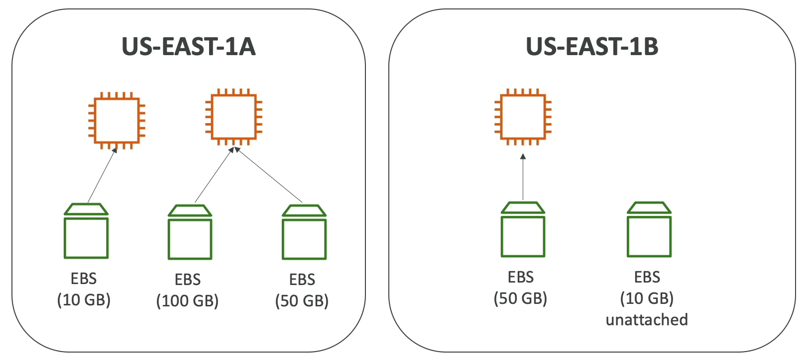

## Introduction

- Elastic Block Store Volume is a network drive you can attach to your instance while they run.
- Persists data even after the instance is terminated.
- Multi-attach feature for some EBS. Only be mounted to one instance at a time.
- Bound to specific availability zone. (Instance and EBS Volume should be in the same zone.)
- Its a network drive and not a physical drive.
  - Since it uses network to communicate, there might be a bit of latency.
  - Can be detached from an EC2 instance and attached to another one quickly.
- Locked to an Availability Zone.
  - To move a volume across, you need to snapshot it.
- Have a provisioned capacity (size in GBs and I/O per second)
  - Billed for the provision capacity.
  - Can increase capacity over time.

## Delete on Termination attribute

- Controls the EBS behavior when an instance is terminated.
- Can be controlled by AWS Console or AWS CLI.

## EBS Elastic Volumes

- Dont have to detach a volume or restart the instance to change it.
- Modify volume from the console.
- Increase volume size (not decrease).
- Change volume type.
  - Gp2 -> Gp3
  - Specify desired I/O per second (or it will guess)
- Increase or decrease performance.
